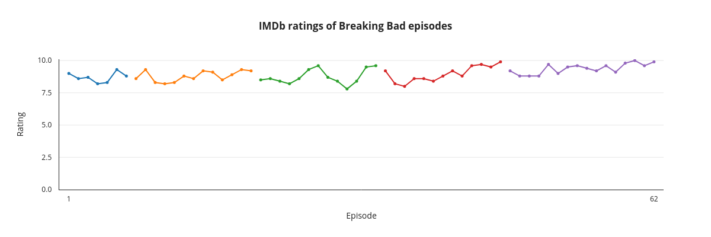

# graph
A Python tool for generating IMDb rating graphs of TV series using [OMDb API](http://www.omdbapi.com), [IMDb](http://www.imdb.com) and [Plotly](https://plot.ly).

### Usage
```
usage: graph.py [-h] title username password

positional arguments:
  title       The title of the TV series
  username    The username of your Plotly account
  password    The password of your Plotly account

optional arguments:
  -h, --help  show this help message and exit
```

### Example input
```
$ python graph.py 'Breaking Bad' 'johndoe' 'Tr0ub4dor&3'
```

### Example output

